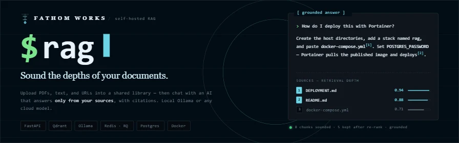

# `$ rag`

**A self-hosted web application that lets multiple authenticated users upload documents and chat with an AI that answers questions grounded in their content.** Built for production — async, Dockerized, and configurable to use a local Ollama model or any cloud LLM provider.

---

## `[ what it does ]`

- Organize documents into **named, isolated libraries** — keep unrelated corpora separate (e.g. "Spinal Cord Injury", "Jones Act Cases")
- Upload PDFs, text files, or web URLs into any library — or select an entire folder for batch ingestion
- Chat with an AI assistant that searches **one or more libraries simultaneously**, answering questions using only their documents, with clickable source citations and one-click document download
- Admin-managed libraries — only the admin adds, removes, or creates collections; all authenticated users can pick any combination of libraries and query across them
- Switch between local (Ollama) and cloud LLM providers (OpenAI, Anthropic, or any OpenAI-compatible endpoint) from the admin UI
- **MCP server included** — `mcp_server.py` connects Claude Desktop or Claude Code directly to the knowledge base for querying, ingestion, and management

---

## `[ stack ]`

| Component | Technology |
|-----------|------------|
| Backend | FastAPI + Gunicorn (async workers) |
| Vector database | Qdrant (isolated per-library collections) |
| Auth database | PostgreSQL + SQLAlchemy |
| Job queue | Redis + RQ (background ingestion) |
| Embeddings | `BAAI/bge-large-en-v1.5` via sentence-transformers |
| LLM | Ollama (bundled container) or OpenAI / Anthropic / generic |
| Frontend | Jinja2 templates + custom Fathom CSS (no framework dependency) |

---

## `[ prerequisites ]`

- Docker and Docker Compose v2+
- 4 GB+ RAM and 10 GB+ free disk space (for models and embeddings)

Ollama runs inside the stack as its own container — no host installation needed. After the stack is up, pick and pull a model from the admin UI at `/admin/llm-settings`.

---

## `[ quick start ]`

### 1. prepare host directories (one-time)

```bash
$ export DATA_ROOT=/storage/rag
$ sudo mkdir -p "$DATA_ROOT"/{postgres,qdrant,redis,uploads,ollama}
```

The stack binds named Docker volumes to these paths. Override `DATA_ROOT` in your `.env` if `/storage/rag` doesn't suit your setup.

### 2. clone and configure

```bash
$ git clone https://github.com/jemplayer82/RAG.git
$ cd RAG
$ cp .env.example .env
# Only POSTGRES_PASSWORD is required — edit .env and set it
```

### 3. start the stack

```bash
$ docker compose up -d
$ curl http://localhost:8000/api/health
```

Browse to **http://localhost:8000** and register an account. The first registered user becomes admin automatically.

> [!NOTE]
> A cloned repo auto-loads `docker-compose.override.yml`, which builds the image locally. To use the pre-built published image instead, run `docker compose -f docker-compose.yml up -d`.

---

## `[ deploying via portainer ]`

Make sure the host directories exist first (see Prerequisites), then:

1. Go to **Stacks → Add stack**, name it `rag`
2. Paste the contents of `docker-compose.yml` into the web editor — do **not** include `docker-compose.override.yml` (Portainer's paste mode has no Dockerfile access)
3. Add environment variables:
   - `POSTGRES_PASSWORD` — required
   - `RAG_PORT` — optional, defaults to `8000`
   - `OPENAI_API_KEY` / `ANTHROPIC_API_KEY` — only if using a cloud LLM
4. Deploy — Portainer pulls `ghcr.io/jemplayer82/rag:latest`

---

## `[ first-time setup ]`

1. Register at `/register` — the first account is automatically promoted to admin
2. Log in
3. Visit `/admin/llm-settings` — select a provider and pull or configure a model
4. Go to **Libraries** and create at least one library (e.g. "My Documents")
5. Go to **Add Sources**, select the library, and upload a PDF or enter a URL
6. Wait for the ingestion job to finish (progress is visible in the upload UI)
7. Open **Chat**, pick a library from the dropdown, and start asking questions

> [!NOTE]
> On a fresh install, a starter library named "My Library" is created automatically when the first admin registers, so you can skip step 4 and go straight to adding sources.

---

## `[ libraries ]`

Each library is an independent Qdrant collection — documents in different libraries never cross-contaminate. The admin creates and manages libraries; any authenticated user can choose which one to query.

**Common workflows:**

- Admin creates a "Spinal Cord Injury" library and a "Jones Act" library
- Uploads the relevant documents to each
- Users pick a library in the Chat header before asking questions — only that library's documents are searched

**Persistence:** Library data (vectors, documents, uploaded files) is stored on bind-mounted host paths and survives container rebuilds, image updates, and `docker compose down`.

---

## `[ environment variables ]`

| Variable | Required | Description |
|----------|----------|-------------|
| `POSTGRES_PASSWORD` | Yes | PostgreSQL password |
| `JWT_SECRET` | No | Auto-generated on first boot and persisted to `/storage/rag/uploads/.secrets.env` |
| `ENCRYPTION_KEY` | No | Auto-generated on first boot (same persistence as above) |
| `RAG_PORT` | No | Host port for the web UI (default: `8000`) |
| `DATA_ROOT` | No | Host base directory for data (default: `/storage/rag`) |
| `LLM_PROVIDER` | No | `ollama` (default), `openai`, `anthropic`, or `generic` |
| `LLM_MODEL` | No | Model name — leave blank to configure from the admin UI |
| `LLM_BASE_URL` | No | Fixed to the in-stack Ollama (`http://ollama:11434`) in `docker-compose.yml`. For a remote Ollama or cloud endpoint, set the Base URL per-provider in the admin UI instead. |
| `OPENAI_API_KEY` | No | Required only when using OpenAI |
| `ANTHROPIC_API_KEY` | No | Required only when using Anthropic |
| `EMBED_MODEL` | No | HuggingFace embedding model (default: `BAAI/bge-large-en-v1.5`) |
| `EMBED_DEVICE` | No | `cpu` or `cuda` (default: `cpu`) |
| `CHUNK_SIZE` | No | Token chunk size for ingestion (default: `600`) |

See `.env.example` for the full list with descriptions.

---

## `[ architecture ]`

```
Browser
│
▼
FastAPI app (:8000) ← the only host-published service
├── PostgreSQL         ← users, libraries, documents, job records
├── Qdrant             ← isolated per-library vector collections
├── Redis → rag-worker ← background document ingestion
└── Ollama             ← local LLM inference
```

Only the `rag` container exposes a port to the host. All other services are reachable only from inside the Docker network.

---

## `[ production deployment (vps) ]`

```bash
$ git clone https://github.com/jemplayer82/RAG.git /opt/rag
$ cd /opt/rag
$ cp .env.example .env && nano .env
$ docker compose up -d
```

For HTTPS, place a TLS terminator (Caddy, Cloudflare Tunnel, or nginx) in front of port 8000. TLS is intentionally left to the host layer.

CI/CD is configured in `.github/workflows/deploy.yml`. Add `VPS_HOST`, `VPS_USER`, and `VPS_SSH_KEY` to your GitHub repository secrets to enable auto-deploy on push to `master`.

---

## `[ local development (without docker) ]`

```bash
$ python -m venv venv && source venv/bin/activate
$ pip install -r requirements.txt
$ cp .env.example .env
# Add OLLAMA_BASE_URL=http://localhost:11434 to .env if Ollama runs on the host

# Requires local PostgreSQL, Qdrant, and Redis
$ uvicorn app_fastapi:app --reload --port 8000
```

---

## `[ mcp server ]`

`mcp_server.py` (included in this repo) exposes the RAG knowledge base as an MCP server. Connect it to Claude Desktop or Claude Code to query, ingest, and manage the knowledge base without opening the web UI — the server talks to the deployed RAG API over HTTP, so no changes to the Docker stack are needed.

### 1. install deps (local machine only)

```bash
pip install -r requirements-mcp.txt   # mcp + httpx — kept out of the Docker image
```

Requires **Python 3.10+** on the machine running Claude (not inside Docker).

### 2. add to Claude Desktop

Edit `~/Library/Application Support/Claude/claude_desktop_config.json` (macOS) or `%APPDATA%\Claude\claude_desktop_config.json` (Windows):

```json
{
  "mcpServers": {
    "rag": {
      "command": "python",
      "args": ["C:/path/to/RAG/mcp_server.py"],
      "env": {
        "RAG_BASE_URL": "http://YOUR_HOST:8000",
        "RAG_USERNAME": "admin",
        "RAG_PASSWORD": "yourpassword"
      }
    }
  }
}
```

### 2. add to Claude Code

```bash
claude mcp add rag -- python /path/to/RAG/mcp_server.py
```

Then set the env vars in `.claude/mcp.json` under the `rag` entry.

### environment variables

| Variable | Description |
|----------|-------------|
| `RAG_BASE_URL` | Base URL of the RAG app (default: `http://localhost:8000`) |
| `RAG_USERNAME` | Username for auto-login (recommended — token self-refreshes on expiry) |
| `RAG_PASSWORD` | Password for auto-login |
| `RAG_TOKEN` | Pre-generated JWT from `localStorage.rag_token` (static — use creds instead) |

### available tools

| Tool | Auth | Description |
|------|------|-------------|
| `query` | any user | Ask a question; searches one or all libraries |
| `list_libraries` | any user | List libraries with IDs and document counts |
| `list_documents` | any user | List documents; optional library and title filters |
| `add_file` | admin | Ingest a local file (PDF, TXT, DOC, DOCX) |
| `add_url` | admin | Ingest a web URL; optional site crawl |
| `get_job_status` | admin | Check ingestion job progress |
| `delete_document` | admin | Remove a document and its vectors |

---

## `[ license ]`

Released under the [GNU AGPL-3.0](LICENSE). If you run a modified version as a
network service, the license requires you to make your source available to its
users.

---


