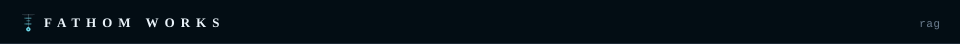

<p align="center"></p>

# `$ rag`

**A private website where you upload your documents and ask an AI questions about them.** The AI answers only from your files and shows which document each answer came from.

**In plain terms:** if you have a pile of PDFs or web pages (case files, research, manuals) and want to search them by asking questions, this runs on your own computer or server so the documents stay with you.

*A [Fathom Works](https://github.com/Jemplayer82) project.*

## `[ what it does ]`

- Sorts documents into separate **libraries**, so unrelated topics never mix.
- Takes PDFs, text files, web links, or a whole folder at once.
- Lets you chat with an AI that searches one or several libraries and links to its sources.
- Works with a local AI (Ollama, which runs on your own machine) or a cloud AI (OpenAI, Anthropic, or any OpenAI-compatible service).
- Includes an MCP server (a plug-in that lets Claude use the tool) in `mcp_server.py`.

## `[ quick start ]`

You need Docker with Docker Compose v2+, 4 GB+ of RAM, and 10 GB+ of free disk space.

Create the folders where the data is kept (one time):

```bash
$ export DATA_ROOT=/storage/rag
$ sudo mkdir -p "$DATA_ROOT"/{postgres,qdrant,redis,uploads,ollama}
```

Download the project and create your settings file. Only `POSTGRES_PASSWORD` is required.

```bash
$ git clone https://github.com/jemplayer82/RAG.git
$ cd RAG
$ cp .env.example .env
# Only POSTGRES_PASSWORD is required — edit .env and set it
```

Start everything and check that it is running:

```bash
$ docker compose up -d
$ curl http://localhost:8000/api/health
```

Open **http://localhost:8000** and register. The first account becomes the admin.

> [!NOTE]
> A cloned repo auto-loads `docker-compose.override.yml`, which builds the image locally. To use the pre-built published image instead, run `docker compose -f docker-compose.yml up -d`.

## `[ usage ]`

1. Log in as admin and open `/admin/llm-settings`. Pick an AI provider and pull or configure a model.
2. Open **Libraries** and create one (a starter "My Library" already exists on a fresh install).
3. Open **Add Sources**, choose the library, and upload a file or enter a web link. Wait for the job to finish.
4. Open **Chat**, pick one or more libraries, and ask questions.

Only the admin creates and manages libraries. Every signed-in user can query any of them. Your data lives on the host folders above and survives restarts and updates.

## `[ configuration ]`

Only `POSTGRES_PASSWORD` is required. Set the rest in `.env`; `.env.example` has the full list.

| Variable | What it does | Default |
|----------|--------------|---------|
| `POSTGRES_PASSWORD` | Database password (required) | none |
| `RAG_PORT` | Port for the web page | `8000` |
| `DATA_ROOT` | Folder where data is stored | `/storage/rag` |
| `LLM_PROVIDER` | `ollama`, `openai`, `anthropic`, or `generic` | `ollama` |
| `LLM_MODEL` | AI model name; leave blank to set it in the admin page | blank |
| `OPENAI_API_KEY` / `ANTHROPIC_API_KEY` | Needed only for that cloud provider | none |
| `EMBED_MODEL` | Model that turns text into searchable numbers | `BAAI/bge-large-en-v1.5` |
| `EMBED_DEVICE` | `cpu` or `cuda` (GPU) | `cpu` |
| `CHUNK_SIZE` | Size of each piece a document is cut into | `600` |
| `JWT_SECRET`, `ENCRYPTION_KEY` | Created automatically on first start | auto |
| `LLM_BASE_URL` | Fixed to the bundled Ollama in `docker-compose.yml` | `http://ollama:11434` |

## `[ docs ]`

- [Deployment and setup details](docs/setup.md): Portainer, libraries, architecture, VPS, running without Docker.
- [MCP server](docs/mcp-server.md): connect Claude Desktop or Claude Code.
- [Quick start](QUICK_START.md)

## `[ license ]`

Released under the [GNU AGPL-3.0](LICENSE). If you run a modified version as a network service, you must make your source available to its users.


